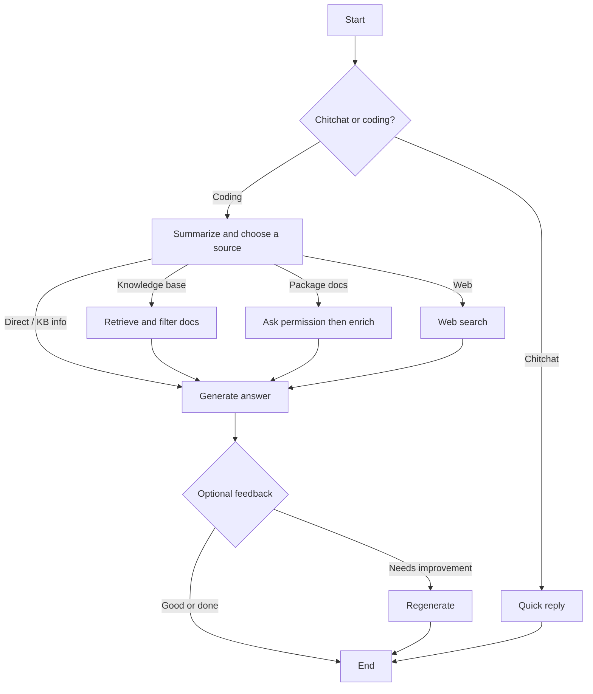

# Documentation Helper Agent

A LangGraph-based agent that answers coding and documentation questions. It classifies your intent, chooses a knowledge source (indexed docs, curated package guides, web search, or a direct answer), generates a response, and can ask for feedback when useful.

## Try it

1. Open the hosted app: [documentation-helper-agent (Vercel)](https://documentation-helper-agent-aur6f7jff-huy-tos-projects.vercel.app/)
2. Register or log in
3. Ask a coding or docs question in the chat

**Limit:** 20 messages per user per day.

## What it does

- Routes casual chat vs programming questions
- Retrieves and filters docs from a vector knowledge base when relevant
- Can enrich answers from curated package documentation (chub), after asking permission
- Falls back to web search when local context is not enough
- Optionally collects feedback and regenerates if the answer needs improvement

## How it works

The agent classifies the question, picks a source (indexed docs, curated package docs, web, or direct), generates an answer, then may ask for feedback.

## Notes

- The **UI** runs on Vercel; the **agent API** runs on Google Cloud Run.
- Deploying or running locally? See [DEPLOYMENT.md](DEPLOYMENT.md).
- Knowledge-base ingestion details: [docs/ingestion.md](docs/ingestion.md).
