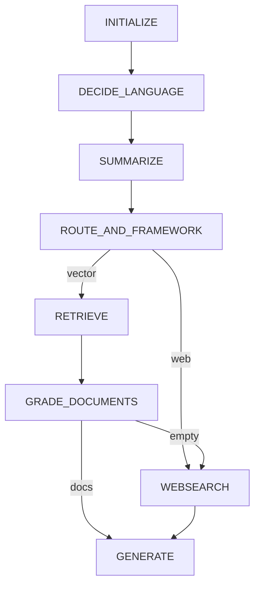

# Simplified graph design (chub enrich focus)

Design notes for keeping [`real_flow`](../agent/graph/flows/real_flow.py) lean while adding **chub enrich** next. See [`chub-mcp-graph-integration.md`](chub-mcp-graph-integration.md) for the CHUB_ENRICH playbook.

**Status:** graph simplifications below are implemented in `real_flow` / `test_flow`. **CHUB_ENRICH is not wired yet.**

## Scope

| In scope | Out of scope / later |
|----------|----------------------|
| Merge `route_query` + `DECIDE_VECTORSTORE` into one LLM call | Advanced-retrieval MCP server (removed) |
| Bound `GRADE_DOCUMENTS` | New reformulate / process-context nodes |
| Single new fallback: `CHUB_ENRICH` (playbook only for now) | Wiring hybrid search |
| Optional later: `hybrid_documentation_search` inside `RETRIEVE` | |

`hybrid_documentation_search` lives as a **placeholder** plain helper in [`agent/graph/hybrid_search.py`](../agent/graph/hybrid_search.py) for a future RETRIEVE enhancement — not an MCP tool, not on the hot path today.

## Target topology

```
INITIALIZE → DECIDE_LANGUAGE → SUMMARIZE
  → ROUTE_AND_FRAMEWORK (one LLM)
       ├─ WEBSEARCH → GENERATE
       └─ RETRIEVE → GRADE_DOCUMENTS
            ├─ docs → GENERATE
            └─ empty → CHUB_ENRICH          ← not implemented yet; today → WEBSEARCH
                 ├─ docs → GENERATE
                 └─ empty → WEBSEARCH → GENERATE
```



Implemented: **`ROUTE_AND_FRAMEWORK`** replaces separate query + vectorstore routers. Still pending: **`CHUB_ENRICH`** (empty graded docs still go straight to `WEBSEARCH` via `to_search_web_or_not`).

## Current-graph simplifications

1. **Merge `route_query` + `DECIDE_VECTORSTORE` (2 LLM → 1)** — implemented as [`route_and_framework`](../agent/graph/chains/route_and_framework.py) + node [`route_and_framework.py`](../agent/graph/nodes/route_and_framework.py). Returns `{datasource, framework}`; language gate (python/javascript only for vectorstore) stays in the node. `SUMMARIZE → ROUTE_AND_FRAMEWORK → RETRIEVE | WEBSEARCH`. Legacy [`query_router`](../agent/graph/chains/query_router.py) / [`vectorstore_router`](../agent/graph/chains/vectorstore_router.py) / [`decide_vectorstore`](../agent/graph/nodes/decide_vectorstore.py) remain for [`simple_flow`](../agent/graph/flows/simple_flow.py).
2. **Bound `GRADE_DOCUMENTS`** — only LLM-grade top 5 chunks (`MAX_DOCS_TO_GRADE`), preferring metadata score when present, else retriever order.
3. **No reformulate / process-context nodes** — `SUMMARIZE` already produces a usable query; grading already filters weak context.
4. **Defer hybrid search** — [`retrieve.py`](../agent/graph/nodes/retrieve.py) stays single-namespace vector search until `hybrid_documentation_search` is implemented and measured.

## Capability map

| Capability | Where it lives |
|------------|----------------|
| Web vs vector + namespace choice | `ROUTE_AND_FRAMEWORK` (one LLM) |
| Language detect | Existing `DECIDE_LANGUAGE` |
| Vector retrieve + grade | Existing `RETRIEVE` / `GRADE_DOCUMENTS` (bounded) |
| Hybrid multi-ns search (later) | [`hybrid_search.py`](../agent/graph/hybrid_search.py) → call from `RETRIEVE` |
| Chub enrich before Tavily | `CHUB_ENRICH` ([playbook](chub-mcp-graph-integration.md)) — not wired yet |

## UX when the path is still slow

- Emit CopilotKit progress on `RETRIEVE`, `GRADE_DOCUMENTS`, `CHUB_ENRICH`, `WEBSEARCH` with short status strings.
- Stream `GENERATE`; do not add mid-retrieval confirmation interrupts.
- Keep HITL at the existing sentiment step only.
- Use `IMMEDIATE_MESSAGE_*` when entering slow fallbacks (chub or web), not before every retrieve.

## Out of scope for this design pass

- Implementing `CHUB_ENRICH` (follow the chub playbook when cued)
- Implementing real `hybrid_documentation_search` bodies
- Replacing Tavily entirely
