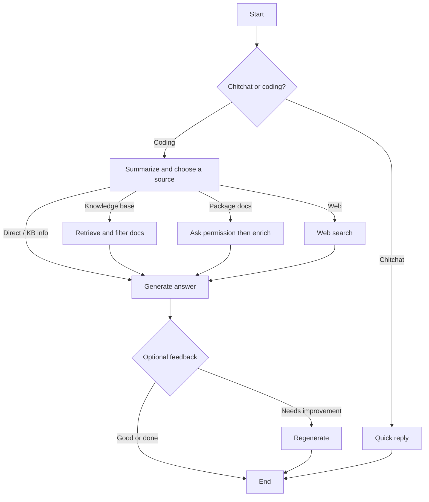

# README + DEPLOYMENT.md redesign

**Date:** 2026-08-11  
**Status:** Approved for planning  
**Goal:** Make `README.md` end-user / demo oriented; move operator/deploy content into `DEPLOYMENT.md`.

## Decisions

| Topic | Choice |
|-------|--------|
| Primary audience | End users / demos |
| Graph depth | High-level only + simple mermaid |
| Layout | Landing-page README (scannable) |
| Vercel docs | Keep `VERCEL_DEPLOYMENT.md`; link from `DEPLOYMENT.md` |

## README.md (target)

### Structure

1. **Overview** — Short paragraph: LangGraph agent that answers coding/docs questions using retrieval, curated package docs (chub), web search, and generation with quality checks.
2. **Try it** — Hosted app URL: https://documentation-helper-agent-aur6f7jff-huy-tos-projects.vercel.app/ — register/login; **20 messages per user per day**.
3. **What it does** — 4–5 plain bullets (intent routing, KB retrieval, chub enrich, web fallback, feedback loop). No env/models.
4. **How it works** — High-level mermaid + one-line caption.
5. **Notes** — Split UI (Vercel) + agent (Cloud Run); pointer to `DEPLOYMENT.md`.
6. **Further reading** — Single deploy/local line → `[DEPLOYMENT.md](DEPLOYMENT.md)`; optional link to `docs/ingestion.md` if useful for curiosity, not required for demos.

### Mermaid (approved)

Caption: the agent classifies the question, picks a source (indexed docs, curated package docs, web, or direct), generates an answer, then may ask for feedback.

### Explicitly out of README

- Environment variables
- Installation / pip / npm
- Cloud Run / Docker / Cloud Build steps
- RunPod, Firebase env blocks
- Performance / monitoring operator guidance
- Model provider configuration details

## DEPLOYMENT.md (target)

Move current README operator content, lightly organized:

1. Architecture — Vercel UI + Cloud Run agent (short)
2. Model / provider options — Ollama vs Inference API / RunPod
3. Environment variables — full block from current README (+ Firebase section)
4. Installation & local run — clone, deps, `.env`, uvicorn
5. Knowledge base ingestion — short pointer to `docs/ingestion.md`
6. Backend deploy (Cloud Run) — existing Cloud Build / Docker steps
7. Frontend deploy — link to [`VERCEL_DEPLOYMENT.md`](VERCEL_DEPLOYMENT.md)
8. RunPod / performance — optional sections from current README

Do **not** merge or delete `VERCEL_DEPLOYMENT.md`.

## Non-goals

- Rewriting `VERCEL_DEPLOYMENT.md` content
- Changing app behavior, auth limits, or graph code
- Adding contributor onboarding beyond a deploy pointer
- Formal design-doc commit of implementation plans beyond this spec

## Implementation checklist (for plan)

- [ ] Create `DEPLOYMENT.md` from current README deploy/env/install sections
- [ ] Rewrite `README.md` per structure above
- [ ] Ensure README links to DEPLOYMENT.md; DEPLOYMENT.md links to VERCEL_DEPLOYMENT.md
- [ ] Spot-check that no critical deploy steps were dropped in the move
